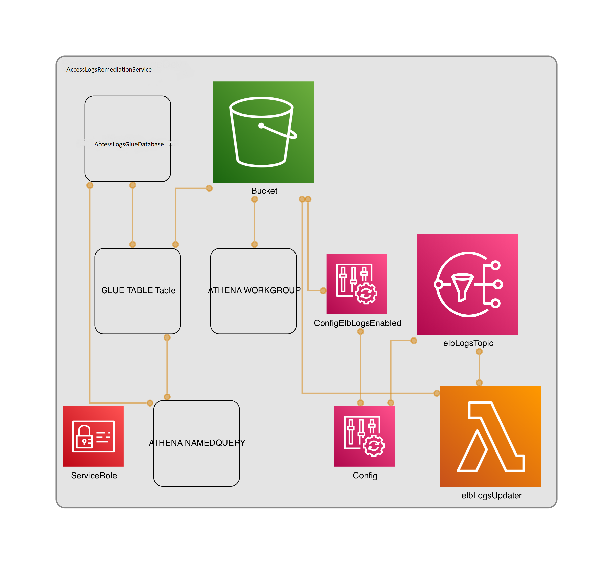

# ELB Logging

This is an implementation of a shared S3 bucket for AWS accounts using the AWS CDK (typescript) as the configuration language.

## Features

Takes advantage of AWS Config service compliance rules to determine if a given application load balancer is configured with a logging bucket. If not, using the AWS Config console, a noncompliant ALB can be remediated at the click of a button which will notify the ELB Logs Updater Lambda function of the noncompliant ALB for remediation.

[AWS Config](https://docs.aws.amazon.com/config/latest/developerguide/WhatIsConfig.html) is used to identify unprotected application load balancers with the [elb-logging-enabled](https://docs.aws.amazon.com/config/latest/developerguide/elb-logging-enabled.html) managed rule.
When AWS Config detects the violation of the elb-logging-enabled rule and flags the resource (ALB) as _noncompliant_, the resource can be easily identified via the console and remediated by clicking the "remediate" button. This sends a notification to SNS that contains the resource ARN. The SNS topic is subscribed-to by a Lambda function which parses the resource ID and adds the logging bucket configuration to the ELB.

## Diagram

Auto-generated using [cdk-dia](https://github.com/pistazie/cdk-dia)

